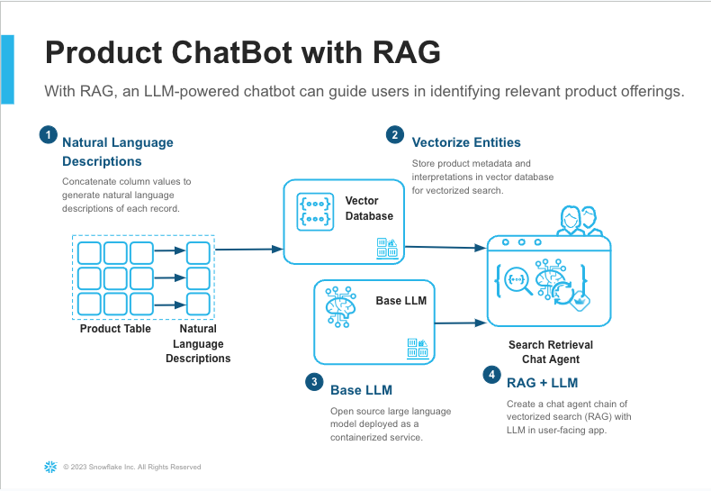
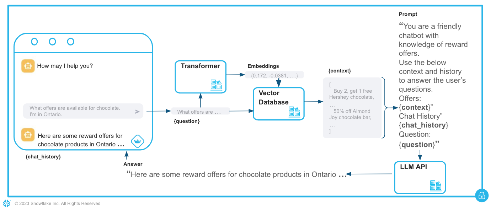

# Product Chatbot 
Created by Jason Summer

 This project delivers an LLM-powered chatbot to answer questions about product reward offers. Given a company’s product catalog, this chatbot enables non-technical users to easily answer questions about product reward offers using natural language queries. The approach detailed below is done entirely within the security perimeter of Snowflake by bringing CPU compute, Nvidia GPU compute, and LLM model(s) to the data in Snowflake.

<figure>
  
  <figcaption><i>Example generation</i></figcaption>
</figure>

## Table of Contents

- [High-Level Architecture](#high-level-architecture)
  - [Pre-Processing: Natural Language Descriptions](#pre-processing-natural-language-descriptions)
  - [Vector Database](#vector-database)
  - [LLM](#llm)
  - [Search Retrieval Chat Agent (Streamlit)](#search-retrieval-chat-agent-streamlit)
- [Setup](#setup)
  - [Set Account Information](#set-account-information)
  - [Create Product Description Formula](#create-product-description-formula)
  - [Start Weaviate Vector Database](#start-weaviate-vector-database)
  - [Start LLM Service](#start-llm-service)
  - [Chat Interface](#chat-interface)
  - [Shutdown](#shutdown)
- [Recommended Next Steps](#recommended-next-steps)
- [Gotchas & Tips](#gotchas--tips)
- [FAQ](#faq)

# High-Level Architecture

At its core, the build provides an MVP chatbot that combines mechanisms for chat, conversation memory, retrieval augmented history (RAG), prompt engineering, and a Streamlit user interface. In this stack, RAG is the mechanism that queries product metadata in a vectorized database and returns relevant products. Prompt engineering is used to create a robust prompt to inform the LLM how to act and what tool(s) it has at its disposal. The underlying product metadata are contained in a Snowflake table and the entire chatbot implementation runs in Snowpark Container Services (SPCS).


<figure>
    
    <figcaption><i>Product chatbot high-level architecture.</i></figcaption>
</figure>

In short, natural language descriptions of product metadata are generated (step #1) as a pre-processing step and stored as text and embeddings in an open-source vector database (step #2). This vector database is running in a container service. While not depicted, there is another container service interacting with the vector database service, which is actually creating the embeddings from text. 

In addition, another container service (step #3) loads an open-source LLM with an API endpoint for inference. The final piece (step #4) combines the LLM API and RAG retriever within a chat agent in a simple Streamlit UI. 

At prompt time, the RAG retriever will determine which *n* products are most similar to the user's question and render those products as context to the LLM prompt. Each of these components are described in greater depth below. Please note that the pre-processing in step 1 must occur before subsequent steps. However, steps 2 and 3 can be done in any order. Steps 1-3 must be completed before step 4 provides the final UI.

### Pre-Processing: Natural Language Descriptions
On their surface, LLMs rely on natural language imputs. For each product record, a natural language interpretation is created which will form the basis of downstream RAG architecture. To create the natural language interpretation, we design a simple concatentation of strings and column values. 

For example:
```
  {
  "HYPERLINK": "www.outdoorenthusiasts.com/hikingbackpack",
  "ORGANIZATION_NAME": "Outdoor Enthusiasts",
  "PRODUCT_CATEGORY": "Outdoor & Recreation",
  "PRODUCT_DESCRIPTION": "Embark on your next adventure with our Hiking Backpack. This durable and ergonomic backpack is designed to carry all your essentials comfortably, with multiple compartments for organization. Explore the great outdoors with Outdoor Enthusiasts' Hiking Backpack.",
  "PRODUCT_NAME": "Hiking Backpack",
  "QUALIFICATION": "Purchase Hiking Backpack and write a review on our website",
  "REWARD": "$90",
  "REWARD_TYPE": "cash back"
}
```
is captured as 
```
"Company Outdoor Enthusiasts is offering a $90 cash back for a Outdoor & Recreation category product. To receive the reward, Purchase Hiking Backpack and write a review on our website. The product description is Embark on your next adventure with our Hiking Backpack. This durable and ergonomic backpack is designed to carry all your essentials comfortably, with multiple compartments for organization. Explore the great outdoors with Outdoor Enthusiasts' Hiking Backpack. More info at www.outdoorenthusiasts.com/hikingbackpack."
```

### Vector Database
This build deploys a weaviate instance in SPCS as an open source vector database. The weaviate service is connected to another (GPU-backed) service that serves a transformer model (specifically, sentence-transformers-multi-qa-MiniLM-L6-cos-v1). As the product descriptions and metadata are added to weaviate, their associated embeddings are generated by the transformer service and stored. The result is a vector database of products, each featuring text and embeddings that can be searched based on keywords, semantic meaning, or both. 

### LLM
This chatbot is powered by open source LLMs, which can be loaded and served in a number of different ways. This implementation leverages the vLLM framework to download a foundational model from HuggingFace to the SPCS container and serve an inference endpoint. The API endpoint can be encapsulated in a chat agent in the downstream UI as if it were any 3rd party API service. However, no data leaves the Snowflake ecosystem. 

### Search Retrieval Chat Agent (Streamlit)
A conversational agent is initialized in Streamlit that incorporates the VLLM API as its LLM and a vector database retriever as an available tool. A user's question will be used be passed as a query to weaviate, which will perform a hybrid search based on the combination of keyword search and embedding-based semantic meaning. The resulting *n* relevant products from the weaviate query will be passed inside of prompt given to the LLM. In addition to the relevant product context, the prompt also contains the user session's chat history and instructions that dictate such things as Do's, Don't, behavior, and formatting. Below is a depiction of how the solution works as prompt time.
<figure>
    
    <figcaption><i>Response generation at prompt time.</i></figcaption>
</figure>

# Setup
Setup will start with account setup followed by the same high-level process described above.
1) account setup
2) generate product descriptions
3) create vector database service and store product data in it
5) start LLM service
5) start Streamlit service

First, we will specify account information.

### Set Account Information
Snowflake account information can be automatically set through the `setup/` directory. First, update the variables in setup/setup.yaml.

> NOTE: This build requires account level access to Snowpark Container Services and user-level grants to create (or use) Snowflake COMPUTE POOLS, WAREHOUSES, STAGES, IMAGE REPOSITORIES, and SERVICES. Please see [Common Setup](https://docs.snowflake.com/developer-guide/snowpark-container-services/tutorials/common-setup#create-snowflake-objects) for additional details about prerequisite objects and privileges. 

|VARIABLE          | DESCRIPTION                                    |
|------------------|------------------------------------------------|
HUGGINGFACE_TOKEN  |Hugging Face token to download LLM
FILES_STAGE        |Snowflake stage to contain working files and LLM
SPEC_STAGE         |Snowflake stage to contain SPCS spec file
UDF_STAGE          |Snowflake stage to contain briefly used UDF
DATA_STAGE         |Snowflake stage to weaviate data
IMAGE_REPOSITORY   |Snowflake image repository
SNOW_ROLE          |Snowflake role with access to SOURCE_TABLE
SNOW_DATABASE      |Snowflake database containing SOURCE_TABLE
SNOW_SCHEMA        |Snowflake schema containing SOURCE_TABLE
SNOW_WAREHOUSE     |Snowflake warehouse accessible to SNOW_ROLE
SOURCE_TABLE       |Snowflake product table
SOURCE_TABLE_ID    |Snowflake product table ID column
CHAT_LOG_TABLE     |Snowflake table to capture Streamlit log

Once complete, run `setup/setup.ipynb` to update Snowflake values throughout the repo. For local environment setup, please follow https://docs.snowflake.com/en/developer-guide/snowpark/python/setup. An environment with snowflake-snowpark-python is sufficient. 

You will need to authenticate to create a Snowpark session before running the Snowpark. See https://docs.snowflake.com/en/developer-guide/snowpark/python/creating-session for more information about creating a Snowpark session.

### Create Product Description Formula
Navigate to `describer/describe.ipynb` and again create a Snowpark session. The cell marked with 
```
################################################
##### This is the cell to change contents ######
################################################
```
should be changed based on how you want to craft your product descrition from the product columns. Within the cell, specify the sentence structure, columns for null/empty values should be imputed, and capture any unnatural column values that should be replaced. An example for the latter would be changing REWARD_TYPE values of `Cash`, `Card`, `Code` to `cash back`, `gift card`, `discount code`, respectively. The LLM will likely be able to do some translation, such as state abbreviations to states but others may not be as obvious.

Run the `describer/describe.ipynb` once you've made the proper updates. The results can be viewed in column DESCRIPTION of table DESCRIBER_RESULTS (or alternative name if variable TARGET_TABLE is reassigned).

### Start Weaviate Vector Database

#### Class Object
Navigate to `weaviate/class_obj.json`. The `class_obj.json` file contains the schema that weaviate will populate with your product metadata. More specifically, every **DESIRED** column of the product Snowflake table will be captured as a property in weaviate. Update the `name`, `dataType`, `description` to ensure you have one for every **DESIRED** column in the product table. The final property, `DESCRIPTION`, should not be changed and will contain the natural language descriptions created in the prior section. The `DESCRIPTION` property will be the one vectorized for semantic search. See https://weaviate.io/developers/weaviate/modules/retriever-vectorizer-modules/text2vec-transformers for more details about weaviate.

#### Docker Image
Next, we need to build and push the docker images for the weaviate, transformer, and jupyter services. Instructions for building and pushing a docker image to Snowflake can be found [here](https://docs.snowflake.com/en/LIMITEDACCESS/snowpark-containers/tutorials/tutorial-1#build-an-image-and-upload). Below is a basic workflow of building and pushing the docker images.

```
docker build --rm --platform linux/amd64 -f <dockerfile> -t <repository_url>/<image_name> .
```
Hint: `<repository_url>/<image_name>` can be found in the name value of the corresponding spec yaml file. 
```
docker login <registry_hostname> -u <username>
```
You should only have to login as part of the first image push.
```
docker push <repository_url>/<image_name>
```

When building these 3 docker images, ensure the Dockerfile and name are correctly matched as shown below. The spec files uploaded will reference these Docker images.
|Dockerfile          | Image Name                   |
|------------------  |------------------------------|
|weaviate.Dockerfile |<repository_url>/weaviate
|text2vec.Dockerfile |<repository_url>/text2vec
|jupyter.Dockerfile  |<repository_url>/jupyter

#### Start Services
Next, open a SQL Worksheet in Snowsight and set the context to the original role, database, and schema specified in `setup/setup.yaml`. Run the below commands in the SQL Worksheet.

```
set mycomment = '{"origin": "sf_ps_wls", "name": "product_chatbot","version": {"major": 1, "minor": 1}}';

create service TEXT2VEC 
in compute pool <pool_name> -- Set to compute pool of >= GPU_NV_S
from @<stage_name> -- Set to SPEC_STAGE from setup/setup.yaml
specification_file = text2vec.yaml
comment = $mycomment;

create service WEAVIATE 
in compute pool <pool_name> -- Set to CPU_X64_M
from @<stage_name> -- Set to SPEC_STAGE from setup/setup.yaml
specification_file = weaviate.yaml
comment = $mycomment;

create service JUPYTER 
in compute pool <pool_name> -- Set to CPU_X64_M
from @<stage_name> -- Set to SPEC_STAGE from setup/setup.yaml
specification_file = jupyter.yaml
comment = $mycomment;
```

Use `CALL SYSTEM$GET_SERVICE_STATUS(<service_name>);` to confirm services are RUNNING. 

In addition, command `CALL SYSTEM$GET_SERVICE_LOGS('WEAVIATE', '0', 'weaviate');` should show a final logged line similar to the below. This message indicates that the connection from weaviate service to transformer service was successful. It may take some time for the confirmation message to appear. 

```
{"action":"grpc_startup","level":"info","msg":"grpc server listening at [::]:50051","time":"2023-11-16T13:56:45Z"}
{"action":"restapi_management","level":"info","msg":"Serving weaviate at http://[::]:8080","time":"2023-11-16T13:56:45Z"}
```

If the weaviate service fails before the connection to text2vec is successful, please drop and recreate both the weaviate and text2vec services. The failure can occur if the compute pools are inactive when the services are initiated.

#### Ingest Data
Once all 3 services are RUNNING, run `SHOW ENDPOINTS IN SERVICE JUPYTER;` and navigate to the `jupyter` URL. Open and run the entire `vectorize.ipynb` notebook within jupyter to ingest product metadata and embeddings into weaviate. Depending on the compute pool instance and metadata size, this may take some time. Ingesting 80,000 product records on a GPU_3 instance required ~20 minutes.

Note that data ingested into Weaviate will remain in Snowflake `DATA_STAGE` meaning re-ingestion is not necessary. Moving forward, only net new data should be ingested. Otherwise, the JUPYTER service is not necessary. 

### Start LLM Service
Navigate to the `vllm/` directory. Build and push the Docker image from `vllm.Dockerfile` with name `<repository_url>/vllm`. The corresponding spec file (`vllm/vllm.yaml`) should also be uploaded to Snowflake stage as part of `setup/setup.ipynb`. Note that `vllm/vllm.yaml` has an environment variable (`LLM_MODEL`) that dictates the specific open-source LLM that is deployed. This can be changed but should be one supported by [vllm](https://docs.vllm.ai/en/latest/models/supported_models.html). In addition, the API endpoint is deployed with the name specified in environment variable `MODEL_NAME`. This name, combined with the vllm endpoint URL, are used to connect to the LLM API for inferencing in the chat interface. While not done here, you can set this name to a legitimate OpenAI model name, such as `gpt-3.5-turbo`, to enable using downstream openai chat mechanisms without actually interfacing with any OpenAI APIs. If changing theese environment variables, re-push `vllm/vllm.yaml` to Snowflake stage before starting the service.

Run the below command to start the LLM service.

```
create service API 
in compute pool <pool_name> -- Set to compute pool of >= GPU_NV_M
from @<stage_name> -- Set to SPEC_STAGE from setup/setup.yaml
specification_file = vllm.yaml
comment = $mycomment;
```

Once RUNNING, use command `CALL SYSTEM$GET_SERVICE_LOGS('api', '0', 'vllm');` to confirm the API is up and running.

### Chat Interface
The end-user chat interface is the Streamlit UI. However, the chat service also includes a Jupyter notebook for ease of experimentation and development. Both will be discussed in this section and the Jupyter notebook will be used to discuss the key mechanisms used for the chatbot.

#### Start Chat Service
Navigate to the `app/` directory. Build and push the Docker image from `Dockerfile` with name `<repository_url>/chat`. The corresponding spec file (`chat/chat.yaml`) should also be uploaded to Snowflake stage as part of `setup/setup.ipynb`. Run the below command to start the Chat service.
```
create service CHAT 
in compute pool <pool_name> -- Set to CPU_X64_M
from @<stage_name> -- Set to SPEC_STAGE from setup/setup.yaml
specification_file = chat.yaml
comment = $mycomment;
```

Once RUNNING, use command `CALL SYSTEM$GET_SERVICE_LOGS('chat', '0', 'chat');` to confirm the API is up and running. You will see log messages for Streamlit and Jupyter.

The chat service is built with three public endpoints (as indicated in `app/chat.yaml`). Execute `SHOW ENDPOINTS IN SERVICE chat;` in a Snowflake SQL Worksheet to see each endpoint and corresponding URL. Accessing each URL will require your Snowflake username and password.

|Endpoint     | Purpose                  |
|------------ |--------------------------|
|`streamlit`    |End-user chat app UI
|`streamlitdev` |Sandbox chat app UI
|`jupyter`      |Sandbox environment

#### View Streamlit
Visit the URL associated with the streamlit endpoint. The UI is a basic chat interface (as developed in `app/app.py`). Along with each LLM response, the chat mechanism will return `source_documents`, which are the relevant product offerings selected by weaviate based on the user question. This can be used to understand the separation of weaviate retrieval from LLM comprehension and response generation. Each user session, marked by login, should remain separate with no overlap of chat history.

Each instance of a user's question, weaviate's returned records, and the LLM's response are recorded in a Snowflake table. The Snowflake table is specified in environment variable `CHAT_LOG_TABLE` and created as part of the setup process.

#### Iterate with Streamlit
Active development can be done directly in  `app.py`. Saving `app.py` and refreshing the `streamlit` endpoint URL will launch the changes directly in the browser. 

However, one may also create a copy of `app.py` (say `app_temp.py`) directly in Jupyter (see next section). Upon saving `app_develop.py`, open a terminal Jupyter and run `streamlit run app_temp.py`. Navigate to the `streamlitdev` endpoint URL to access the new Streamlit app.

#### Develop with Jupyter
We will use the Jupyter notebook (accessible from the `jupyter` endpoint URL) to explore the key mechanisms of the chatbot. Open `chat.ipynb` after logging into the Jupyter endpoint and read through its contents to understand its components. 

### Shutdown
Services can be suspended with the below commands. 

```
ALTER SERVICE TEXT2VEC SUSPEND;
ALTER SERVICE WEAVIATE SUSPEND;
ALTER SERVICE JUPYTER SUSPEND;
ALTER SERVICE API SUSPEND;
ALTER SERVICE CHAT SUSPEND;
```

Alternatively, services can be dropped with the below commands. 
```
DROP SERVICE TEXT2VEC;
DROP SERVICE WEAVIATE;
DROP SERVICE JUPYTER;
DROP SERVICE API;
DROP SERVICE CHAT;
```

# Recommended Next Steps
1) Continue to monitor open-source model releases and performance. See Hugging Face [Chat Arena](https://huggingface.co/spaces/lmsys/chatbot-arena-leaderboard)

2) Experiment with different chat mechanisms and prompt engineering to enforce style, format, etc. Evaluate capability to provide additional tools or parsers that may enable additional use cases/capabilities.

3) Expand product data size, product metadata, and quality of data metadata. As underlying product data grows, it may become helpful to fine-tune model to understand domain knowledge/nomenclature.

4) Consider migrating open-source components to native Snowflake comopnents as they become available. See [Build End-to-End RAG Applications with Snowflake Cortex](https://medium.com/@thechosentom/rag-made-simple-with-snowflake-cortex-74d1df5143fd) for an example of a potential full conversion to native Snowflake capabilities.

5) Establish question accuracy benchmarks for continued evaluations, monitoring, and comparisons. Benchmarks will aid in comparing LLMs, prompts, and parameter tuning.

6) Incorporate recommendation engine likelihood scores into UI for additional personalization based on user.

# Gotchas & Tips
- Many of the required packages are very new and frequently release breaking changes. Hard-code package versions as much as possible. Maintain a healthy amount of skepticism when viewing blogs that appear seamless.
- LLMs are not deterministic so responses are nearly always different.
- The length of a prompt is a balancing act in that LLMs will begin to forget parts of the instructions. Explicit but concise instructions are recommended.
- Larger prompt lengths and model sizes increase response time. However, generally larger models have better out of the box comprehension than smaller models.

# FAQ
1) What LLM did you choose and why?
> Current implementation uses OSS openchat-3.5 (specifically latest version of [openchat-3.5-1210](https://huggingface.co/openchat/openchat-3.5-1210)). As of early Dec 2023, it’s the best performing model of its size (~7B parameters) according to Hugging Face’s leaderboard. In addition, openchat-3.5 is a further optimized/trained version of llama architecture, which is supported by VLLM architecture (see question 2).

2) What is RAG?
> Retrieval augmented generation (RAG) is the process of optimizing LLM output by referencing additional knowledge or data that is applicable to the end user's question. In this implementation, RAG is used to insert the most relevant products to the LLM prompt directly. Note that RAG is not considered fine-tuning but is commonly used to optimizing responses.

3) What is fine-tuning?
> Fine-tuning can be used to alter the behavior/tone of an LLM or provide it with a large amount of additional knowledge that would not otherwise fit within the maximum prompt length of an LLM (known as its context window). Fine-tuning generally consists of altering a small proportion of the existing model parameters or adding a small number of additional parameters. This can be a compute-intensive process and is highly use-case dependent. 

4) Did you fine-tune/train the model?
> Initially, a Llama-2-7b was fine-tuned (~30% trainable) on product descriptions generated by a base llama-2-7b. The fine-tuned model did not perform significantly better than the base. If a gap in product domain language is found, fine-tuning may be helpful. There are a number of ways to fine-tune but a simple way is to leverage [Hugging Face AutoTrain Advanced directly in SPCS](https://medium.com/snowflake/llm-fine-tuning-with-autotrain-in-snowflake-bc045efd37b1).

5) How are you "serving" the LLM?
> The LLM is deployed in SPCS with VLLM, which creates an API endpoint accessible from other services in SPCS. VLLM will download the model weights from Hugging Face. While an alternative is fastchat, VLLM seems to provide faster throughput, supports more models, is more dependable than fastchat.

6) How does the LLM engage with the product data?
> There is a vector database between the LLM and the user’s question. The vector database contains text and vector data about products. The vector database determines what products are relevant to the question by combining keyword matching and vector similarity. The relevant products are included in the prompt.

7) How is the product data vectorized?
> A natural language description of each product is created. The descriptions and metadata are added as nodes in a vector database. Some node elements are vectorized upon ingestion. Vectorization is done via a GPU-backed transformer service API. It uses embedding model multi-qa-MiniLM-L6-cos-v1, which was designed for semantic search and sentence similarity.

8) How well does the model perform?
> The model is able to comprehend and communicate product descriptions. Use-case applicable benchmarks are ideal to compare model performance.

